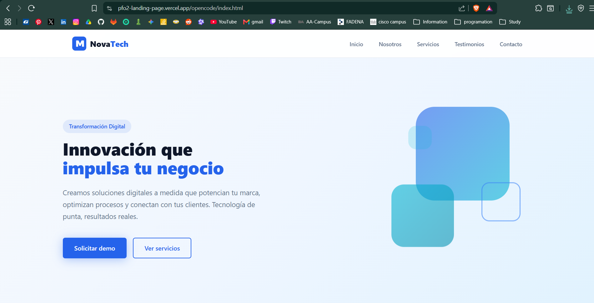
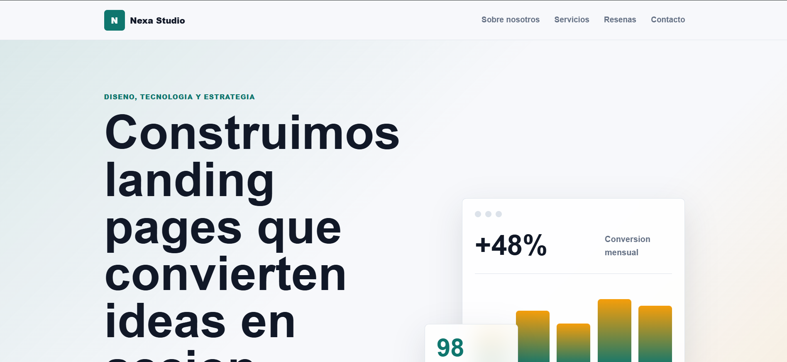

# Comparativa de Agentes de Desarrollo — Landing Page

## Datos del estudiante

- **Nombre:** Nahuel Alejandro Rodriguez Jenco
- **Materia:** Desarrollo de Sistemas Web (Front End) 
- **Facultad:** IFTS N°29
- **Fecha:** 26 Junio 2026

## Link al deploy unificado


## Prompt exacto utilizado

El siguiente prompt fue diseñado siguiendo las guías oficiales de prompt engineering de **Anthropic** (Prompt Engineering Guide) y **OpenAI** (Prompt Engineering Guide), y se ejecutó en ambos agentes sin modificaciones:

```text
Prompt para trabajo practico de facultad.

El Objetivo es: El estudiante debera disenar y estructurar un unico prompt inicial de alta precision basado en
lineamientos oficiales para generar una Landing Page. Este prompt se ejecutara en dos agentes
de desarrollo de software para comparar su capacidad de resolucion autonoma. Los agentes a
utilizar pueden ser gratuitos o pagos, seleccionando dos de las siguientes opciones:


[Rol] = senior developer.
Ponte en el papel de un Senior frontend Developer de una multinacional, aplica ingenieria de prompts y sigue las mejores practicas en esta.


[CONTEXTO Y OBJETIVO]
La tarea seria disenar y estructurar una landing page profesional y completamente responsive, teniendo en cuenta reglas de clean code.
esta debe tener alto impacto visual y tecnico que cumpla estrictamente con los requisitos minimos de estructura para una presentacion academica. No debes omitir ninguna seccion.

[REQUISITOS ESTRUCTURALES OBLIGATORIOS]
Genera los archivos necesarios (HTML, CSS y JS si corresponde) incluyendo las siguientes secciones integradas:
1. Cabecera (Header con menu de navegacion). logo tipo ficticio, y navegacion funcional (con enlaces internos).
2. Hero Section (Seccion principal con titulo impactante y boton de llamada a la
accion - CTA).
3. Descripcion / Sobre Nosotros: Un bloque de texto estilizado que explique el proposito o la mision del sitio.
4. Seccion de Servicios o Caracteristicas: lista de tarjetas (cards) que detalle las caracteristicas principales de forma limpia.(en su defecto si crees que es mejor una cuadricula (grid)).
5. Testimonios o Resenas de clientes: esta debe ser una seccion estetica que simule comentarios de clientes o usuarios ficticio.
6. Formulario de Contacto: Maquetado visual completo (campos de Nombre, Email, Mensaje y boton de envio). No requiere backend funcional.
7. Footer: Con informacion de copyright y enlaces simulados a redes sociales.

[RESTRICCIONES TECNICAS]
- El diseno debe ser totalmente responsivo (adaptable a moviles y computadoras).
- Clean code, semantico, limpio y estructura modular.
- No utilizar ningun tipo de framework si no es estrictamente necesario, prefiere HTML5, CSS moderno (Flexbox/Grid) y JavaScript vanilla bien comentado, o componentes autocontenidos que se puedan previsualizar directamente.
- Genera y escribe todos los archivos correspondientes en el directorio asignado de manera autonoma.

Aclaracion la interfaz de los link se hizo con un prompt aparte. el cual fue:

Interfaz de Acceso (Portada): El proyecto debe iniciar en una pagina de portada que
contenga tres accesos directos:
- Link 1: El texto plano del prompt utilizado.
- Link 2(folder opencode: deepseek v4 flash free): Landing Page generada por el Primer Agente (especificando nombre del
agente y modelo de lenguaje usado).
- Link 3(folder codex: Codex gpt 5.5): Landing Page generada por el Segundo Agente (especificando nombre del
agente y modelo de lenguaje usado).
y los estilos separados de la estructura html.
```

## Capturas de pantalla

### Landing Page — Primer Agente (OpenCode + DeepSeek V4 Flash Free)



### Landing Page — Segundo Agente (Codex + GPT 5.5)



## Agentes utilizados

| Agente | Modelo | Carpeta |
|--------|--------|---------|
| OpenCode | DeepSeek V4 Flash Free | `/opencode/` |
| Codex (OpenAI) | GPT 5.5 | `/codex/` |

## Estructura del proyecto

```
/
├── index.html              # Portada de acceso
├── styles.css              # Estilos de la portada
├── prompt.html             # Prompt utilizado
├── prompt.css              # Estilos de la pagina del prompt
├── prompt_landing_page.md  # Prompt en formato Markdown
├── vercel.json             # Configuracion de deploy
├── README.md               # Este archivo
├── opencode/               # Landing generada por OpenCode
│   ├── index.html
│   ├── styles.css
│   └── script.js
├── codex/                  # Landing generada por Codex
│   ├── index.html
│   ├── styles.css
│   └── script.js
└── screenshots/            # Capturas de pantalla
    ├── opencode.png
    └── codex.png
```
